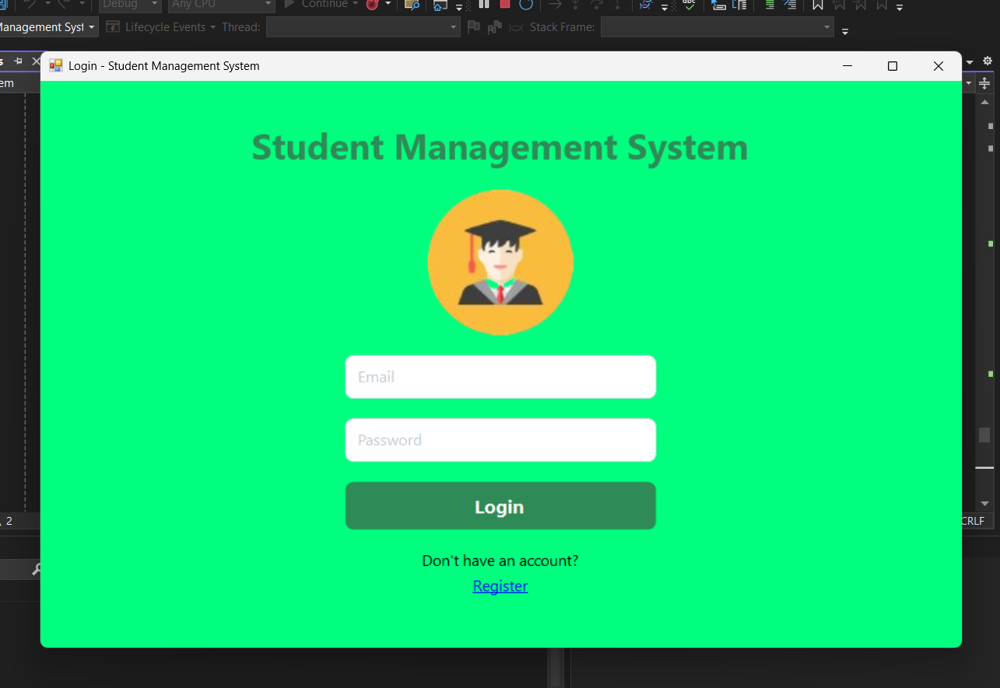
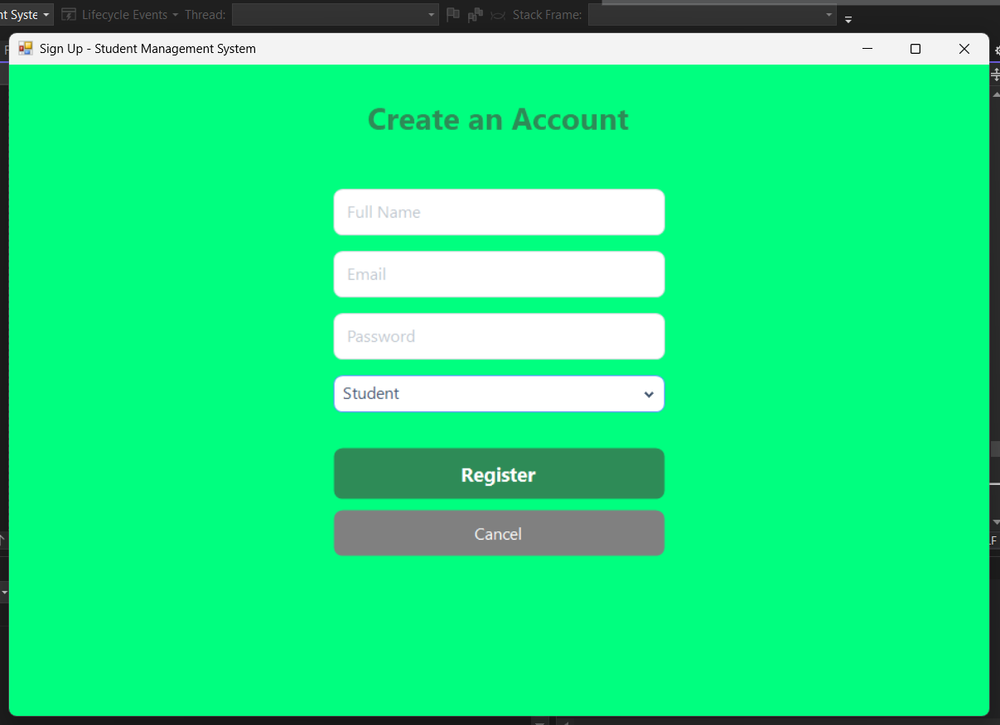

# Student-Management-API

A Django RESTful API for managing students, instructors, and classes. This project enables user authentication and CRUD operations for class management, built for educational and administrative environments.

## Features

- **User Registration & Authentication**
  - Signup endpoint for new users (students or instructors)
  - Secure password storage using Django's password hashing
  - Login endpoint with role-based information in the response
  - Logout endpoint for session management

      

- **Class Management**
  - Add new classes with details (name, code, description, instructor, year level, schedule)
  - Retrieve a list of all classes (GET)
  - Edit/update class information
  - Delete classes
  - All CRUD operations are available via RESTful endpoints

     .png)

- **Role Support**
  - Supports `Student` and `Instructor` roles
  - Role is enforced during registration and available on login

- **Database**
  - Uses MySQL by default (configured for XAMPP)
  - Models for `User` and `ClassInfo`

- **Cross-Origin Resource Sharing (CORS)**
  - All origins allowed (for development/testing)

- **Tech Stack**
  - Python, Django, Django REST Framework
  - MySQL database
  - CORS support for frontend integration

## Endpoints

| Method | Endpoint                       | Description                    |
|--------|------------------------------- |--------------------------------|
| POST   | `/api/signup/`                 | Register a new user            |
| POST   | `/api/login/`                  | Login for existing users       |
| POST   | `/api/add_class/`              | Add a new class                |
| GET    | `/api/classes/`                | Retrieve all classes           |
| POST   | `/api/classes/edit/<id>/`      | Edit class details             |
| DELETE | `/api/classes/<id>/delete/`    | Delete a class                 |
| POST   | `/api/logout/`                 | Logout user                    |

 **UI technologies:**   
 **Backend server:** 
